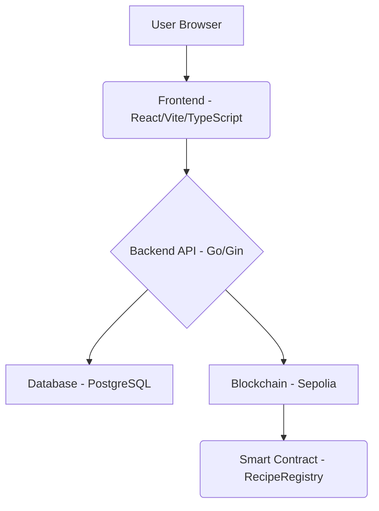
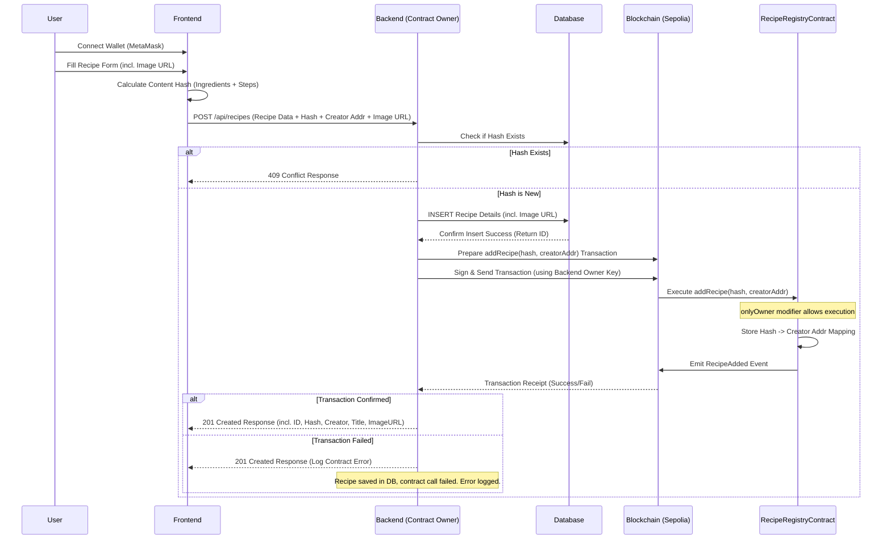

# ProofPot 🍲🌿

ProofPot is a decentralized recipe sharing application where users can securely upload, share, and discover recipes, with ownership verified on the blockchain.

## Table of Contents

- [Why ProofPot?](#why-proofpot)
- [Architecture & Data Flow](#architecture--data-flow)
- [Quick Start](#quick-start)
- [Usage](#usage)
- [Contributing](#contributing)

## Why ProofPot?

In today's digital world, sharing creative content like recipes online often lacks verifiable ownership and provenance. ProofPot aims to solve this by:

*   **Verifiable Ownership:** Each recipe's unique content hash is registered on the Sepolia blockchain using a smart contract, linking it immutably to the creator's Ethereum address.
*   **Decentralized Trust:** Leveraging blockchain eliminates the need for a central authority to verify recipe origins.
*   **Enhanced Discovery:** Provides a modern platform for users to explore and find new recipes.
*   **(Future) Creator Tipping:** Enables direct cryptocurrency tips to recipe creators (Phase 5 - not yet implemented).

## Architecture & Data Flow

This project follows a standard web application architecture with blockchain integration:

**Live Deployment:**

*   Frontend: [`https://proofpot.vercel.app/`](https://proofpot.vercel.app/) (Deployed on Vercel)
*   Backend: [`https://proofpot-backend.fly.dev/`](https://proofpot-backend.fly.dev/) (Deployed on Fly.io)
*   Database: Managed Postgres instance on Fly.io (`proof-pot-db`)
*   Smart Contract: `0xA2D174eBCc81c4305Aee6a8E1A93b3561bD02e4B` (Sepolia Testnet)

**High-Level Architecture:**



**Component Breakdown:**

1.  **Frontend (React/Vite/TypeScript):** User interface built with React and styled using Tailwind CSS (via shadcn/ui). Handles user input, wallet connection (MetaMask), content hashing (ingredients + steps), and communication with the backend API.
2.  **Backend (Go/Gin):** API server built with Go and the Gin framework. Manages recipe data storage (PostgreSQL), interacts with the Ethereum blockchain (via go-ethereum), and handles business logic. **Holds the private key designated as the owner of the RecipeRegistry contract.**
3.  **Database (PostgreSQL):** Stores recipe details like title, ingredients, steps, image URL, creator address, and content hash.
4.  **Smart Contract (Solidity/Hardhat):** A `RecipeRegistry` contract (using OpenZeppelin's `Ownable`) deployed on the Sepolia testnet. It stores a mapping between recipe content hashes and the **original creator's address**. Only the designated owner (the backend server) can call the function to add new recipes.

**Recipe Creation Flow (Low-Level):**



## Deployment & Configuration

### Frontend (Vercel)

*   **URL:** [`https://proofpot.vercel.app/`](https://proofpot.vercel.app/)
*   **Environment Variables:** The following variable needs to be set in the Vercel project settings:
    *   `VITE_API_BASE_URL`: Set to the backend URL including the API path (e.g., `https://proofpot-backend.fly.dev/api`).

### Backend (Fly.io)

*   **App Name:** `proofpot-backend`
*   **URL:** [`https://proofpot-backend.fly.dev/`](https://proofpot-backend.fly.dev/)
*   **Deployment:** Deployed using `flyctl deploy` from the `backend` directory (requires `flyctl` installed and logged in).
*   **Secrets:** The following secrets must be set using `fly secrets set <KEY>="<VALUE>" -a proofpot-backend`:
    *   `DATABASE_URL`: Connection string to the production database (automatically set if using `fly postgres attach`).
    *   `CORS_ALLOWED_ORIGINS`: Comma-separated list of allowed frontend origins (e.g., `https://proofpot.vercel.app,http://localhost:5173`).
    *   `SEPOLIA_RPC_URL`: RPC endpoint URL for the Sepolia testnet (e.g., from Alchemy/Infura).
    *   `BACKEND_PRIVATE_KEY`: Private key of the wallet designated as the owner of the `RecipeRegistry` contract.
    *   `RECIPE_REGISTRY_CONTRACT_ADDRESS`: Address of the deployed `RecipeRegistry` contract.

### Database (Fly.io Postgres)

*   **App Name:** `proof-pot-db` (Managed Fly Postgres instance)
*   **Creation:** Created using `fly postgres create`.
*   **Attachment:** Attached to the backend app using `fly postgres attach --app proofpot-backend proof-pot-db`. This automatically sets the `DATABASE_URL` secret on the backend.
*   **Schema Setup:** After creating the instance, connect using `fly proxy` + `psql` and execute the following:
    ```sql
    -- Create the main table
    CREATE TABLE recipes (
        id SERIAL PRIMARY KEY,
        title VARCHAR NOT NULL,
        ingredients TEXT NOT NULL,
        steps TEXT NOT NULL,
        creator_address VARCHAR NOT NULL,
        content_hash VARCHAR NOT NULL UNIQUE,
        created_at TIMESTAMP WITH TIME ZONE DEFAULT NOW(),
        image_url TEXT
    );

    -- Add an index for faster lookups by content hash (crucial for performance)
    CREATE INDEX idx_recipes_content_hash ON recipes(content_hash);
    ```

## Quick Start (Local Development)

**Prerequisites:**

*   Node.js & npm (or Bun)
*   Go (version 1.24+ recommended)
*   PostgreSQL (running locally or accessible)
*   MetaMask (or similar Ethereum wallet browser extension)
*   Sepolia ETH (for potential contract deployment/testing)

**Setup Steps:**

1.  **Clone the repository:**
    ```bash
    git clone <YOUR_PROJECT_GIT_URL>
    cd proofpot # Or your repository name
    ```

2.  **Smart Contract (Optional - Only if you need to redeploy):**
    *   The necessary contract (`RecipeRegistry`) is already deployed on Sepolia at `0x0CB9e22727D43B2d909081c329D5D056375Fab65`. This address should be configured in the backend's `.env` file.
    *   If you need to modify or redeploy:
        *   `cd smart-contract`
        *   `npm install`
        *   Configure `.env` in this directory for deployment (RPC URL, deployer key).
        *   `npx hardhat compile`
        *   `npx hardhat run scripts/deploy.ts --network sepolia`
        *   Update `RECIPE_REGISTRY_CONTRACT_ADDRESS` in the *backend's* `.env` file with the new address.
        *   `cd ..`

3.  **Backend Setup (Local):**
    *   `cd backend`
    *   **Database (Local):** Ensure PostgreSQL is running locally. Create a database (e.g., `proofpot_dev`). Create the table and index:
        ```sql
        -- Connect to psql for your LOCAL database
        psql -d proofpot_dev

        -- Create the table
        CREATE TABLE recipes (
            id SERIAL PRIMARY KEY,
            title VARCHAR NOT NULL,
            ingredients TEXT NOT NULL,
            steps TEXT NOT NULL,
            creator_address VARCHAR NOT NULL,
            content_hash VARCHAR NOT NULL UNIQUE,
            created_at TIMESTAMP WITH TIME ZONE DEFAULT NOW(),
            image_url TEXT
        );

        -- Create the index
        CREATE INDEX idx_recipes_content_hash ON recipes(content_hash);

        -- Exit psql
        \q
        ```
    *   **Environment (Local):** Copy the example environment file: `cp .env.example .env`.
    *   **Configure `.env` (Local):** Open `.env` and fill in your **local** `DATABASE_URL`, your `SEPOLIA_RPC_URL`, a dedicated `BACKEND_PRIVATE_KEY` (which owns the contract), and the `RECIPE_REGISTRY_CONTRACT_ADDRESS` (e.g., `0xA2D174eBCc81c4305Aee6a8E1A93b3561bD02e4B`).
    *   **Dependencies:** `go mod tidy`.
    *   **Run (Local):** `go run main.go` (Server listens on `http://localhost:8080`).
    *   Keep this terminal running.

4.  **Frontend Setup (Local):**
    *   Open a **new terminal** in the project root.
    *   **Environment (Local):** Ensure you have a `.env` file in the root with `VITE_API_BASE_URL=http://localhost:8080/api` (if you need to override the default `/api`).
    *   **Dependencies:** `npm install` (or `bun install`).
    *   **Run (Local):** `npm run dev` (or `bun dev`).
    *   Open your browser to `http://localhost:5173` (or the port shown).

## Usage

1.  **Connect Wallet:** Use the button in the header, connect MetaMask to Sepolia.
2.  **Create Recipe:** Navigate to "New Recipe", fill the form (including optional Image URL), submit.
3.  **View Recipes:** Browse on the home page. Images should appear if URLs were provided.
4.  **View Detail:** Click a recipe card.

## Contributing

Contributions are welcome! Please feel free to open an issue or submit a pull request.

*(Consider adding sections on Technology Stack, Deployment Status, Future Features, License if desired)*
