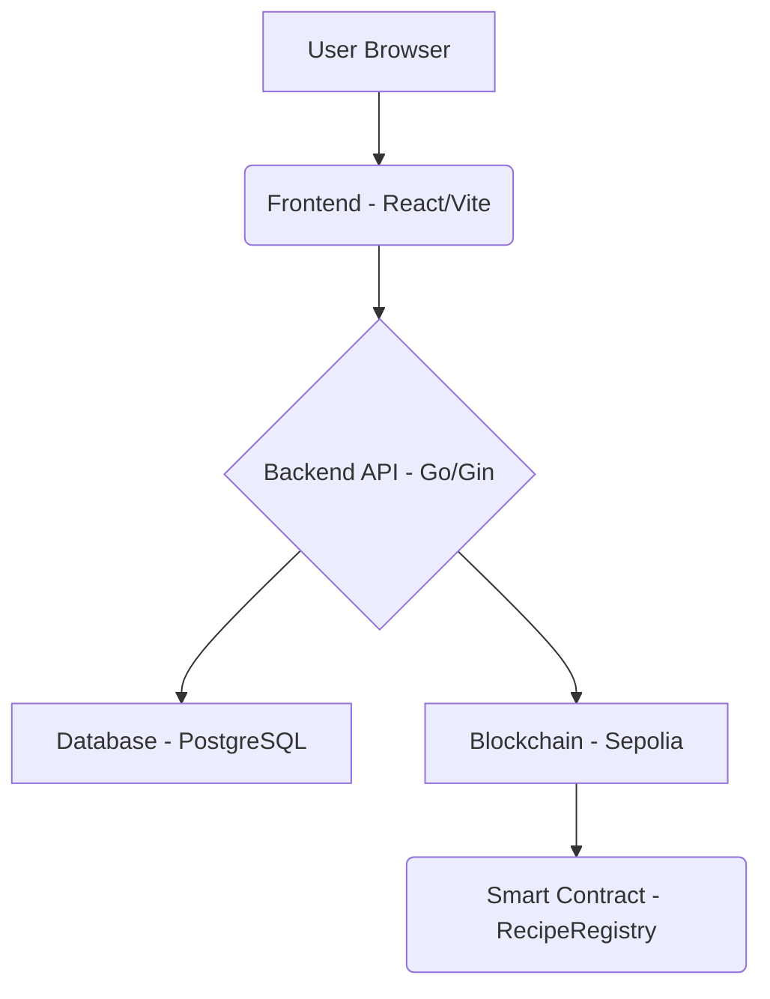
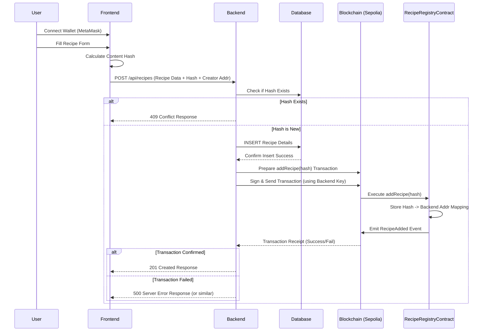

# ProofPot 🍲🌿

ProofPot is a decentralized recipe sharing application where users can securely upload, share, and discover recipes, with ownership verified on the blockchain.

## Table of Contents

- [Why ProofPot?](#why-proofpot)
- [Architecture & Data Flow](#architecture--data-flow)
- [Quick Start](#quick-start)
- [Usage](#usage)
- [Contributing](#contributing)

## Why ProofPot?

In today's digital world, sharing creative content like recipes online often lacks verifiable ownership and provenance. ProofPot aims to solve this by:

*   **Verifiable Ownership:** Each recipe's unique content hash is registered on the Sepolia blockchain using a smart contract, linking it immutably to the creator's Ethereum address.
*   **Decentralized Trust:** Leveraging blockchain eliminates the need for a central authority to verify recipe origins.
*   **Enhanced Discovery:** Provides a modern platform for users to explore and find new recipes.
*   **(Future) Creator Tipping:** Enables direct cryptocurrency tips to recipe creators (Phase 5 - not yet implemented).

## Architecture & Data Flow

This project follows a standard web application architecture with blockchain integration:

**High-Level Architecture:**



**Component Breakdown:**

1.  **Frontend (React/Vite/TypeScript):** User interface built with React and styled using Tailwind CSS (via shadcn/ui). Handles user input, wallet connection (MetaMask), content hashing, and communication with the backend API.
2.  **Backend (Go/Gin):** API server built with Go and the Gin framework. Manages recipe data storage (PostgreSQL), interacts with the Ethereum blockchain (via go-ethereum), and handles business logic.
3.  **Database (PostgreSQL):** Stores recipe details like title, ingredients, steps, creator address, and content hash.
4.  **Smart Contract (Solidity/Hardhat):** A `RecipeRegistry` contract deployed on the Sepolia testnet. It stores a mapping between recipe content hashes and the address that registered them (currently the backend server's address).

**Recipe Creation Flow (Low-Level):**



## Quick Start

**Prerequisites:**

*   Node.js & npm (or Bun)
*   Go (version 1.18+ recommended)
*   PostgreSQL (running locally or accessible)
*   MetaMask (or similar Ethereum wallet browser extension)
*   Sepolia ETH (for potential contract deployment/testing)

**Setup Steps:**

1.  **Clone the repository:**
    ```bash
    git clone <YOUR_PROJECT_GIT_URL>
    cd proofpot # Or your repository name
    ```

2.  **Smart Contract (Optional - Only if you need to redeploy):**
    *   The necessary contract (`RecipeRegistry`) is already deployed on Sepolia, and its address should be configured in the backend's `.env` file.
    *   If you need to modify or redeploy:
        *   `cd smart-contract`
        *   `npm install`
        *   Configure `.env` in this directory for deployment (RPC URL, deployer key).
        *   `npx hardhat compile`
        *   `npx hardhat run scripts/deploy.ts --network sepolia`
        *   Update `RECIPE_REGISTRY_CONTRACT_ADDRESS` in the *backend's* `.env` file with the new address.
        *   `cd ..`

3.  **Backend Setup:**
    *   `cd backend`
    *   **Database:** Ensure PostgreSQL is running. Create a database (e.g., `proofpot_dev`). Update connection details in the `.env` file later.
    *   **Environment:** Copy the example environment file: `cp .env.example .env`.
    *   **Configure `.env`:** Open `.env` and fill in your actual `DATABASE_URL`, your `SEPOLIA_RPC_URL` (e.g., from Alchemy/Infura), a dedicated `BACKEND_PRIVATE_KEY` for the server to interact with the contract, and the correct `RECIPE_REGISTRY_CONTRACT_ADDRESS` (use `0x0CB9e22727D43B2d909081c329D5D056375Fab65` if you didn't redeploy).
    *   **Dependencies:** `go mod tidy`
    *   **Run:** `go run main.go` (Server listens on `http://localhost:8080`)
    *   Keep this terminal running.

4.  **Frontend Setup:**
    *   Open a **new terminal** in the project root.
    *   **Dependencies:** `npm install` (or `bun install`)
    *   **Run:** `npm run dev` (or `bun dev`)
    *   Open your browser to `http://localhost:5173` (or the port shown).

## Usage

1.  **Connect Wallet:** Use the button in the header, connect MetaMask to Sepolia.
2.  **Create Recipe:** Navigate to "Create Recipe", fill the form, submit.
3.  **View Recipes:** Browse on the home page.
4.  **View Detail:** Click a recipe card.

## Contributing

Contributions are welcome! Please feel free to open an issue or submit a pull request.

*(Consider adding sections on Technology Stack, Deployment Status, Future Features, License if desired)*
